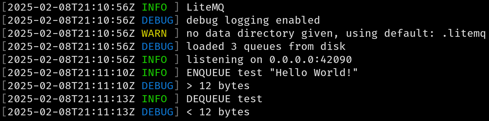

# LiteMQ
Free & open source message queue system, generic in nature, but intended for use in background task processing for web
applications.



## Quickstart
Fastest way to use this software is to run it using docker compose:

```yaml
services:

  litemq:
    image: thekashifmalik/litemq:latest
    ports:
      - 42090:42090

```

You can also use the docker image directly:

```bash
docker run --rm -it -p 42090:42090 thekashifmalik/litemq:latest
```

## Config
You can set the following environment variables:

- `PORT`: Change the port the server uses.
- `LOG_LEVEL` Set to `debug` to enable debug logging. Uses Go log levels.


## Why
Redis [went rogue](https://www.reddit.com/r/redis/comments/1bjs7bo/redis_is_switching_away_from_opensource_licensing/).
[Memcached](https://memcached.org/) works great as a cache and key/value store but it does not provide an equivalent to
Redis lists, which are often used as message queues for background task processing.
